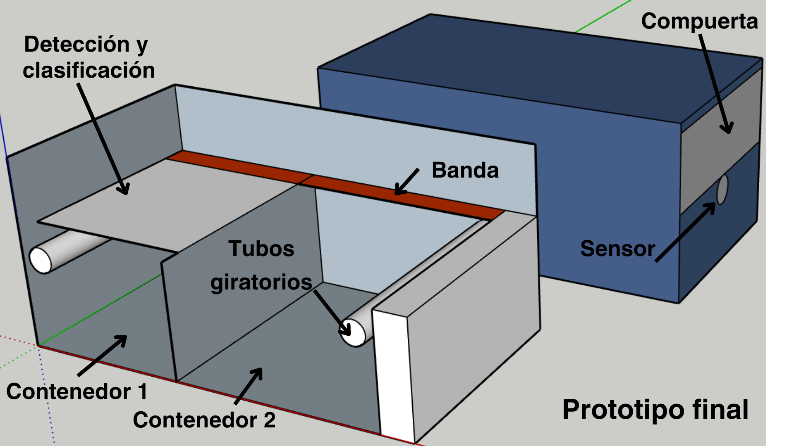
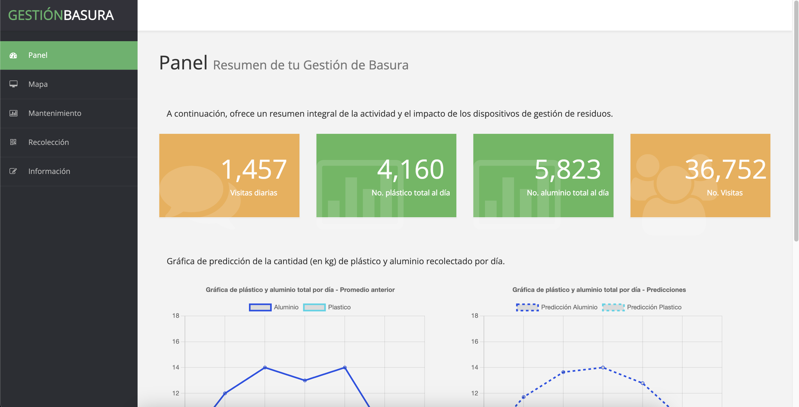
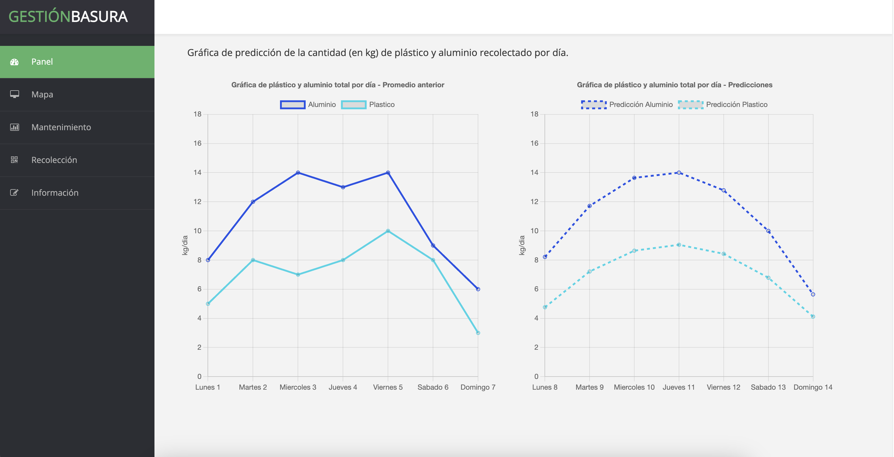
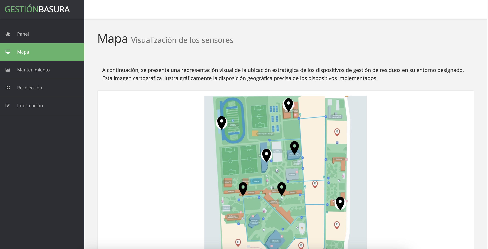
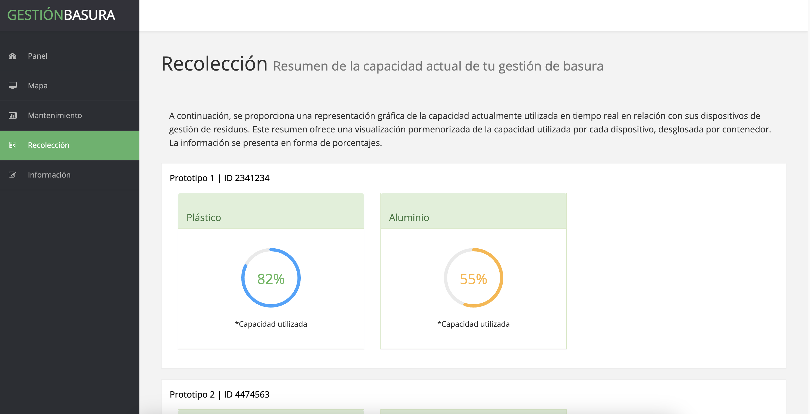
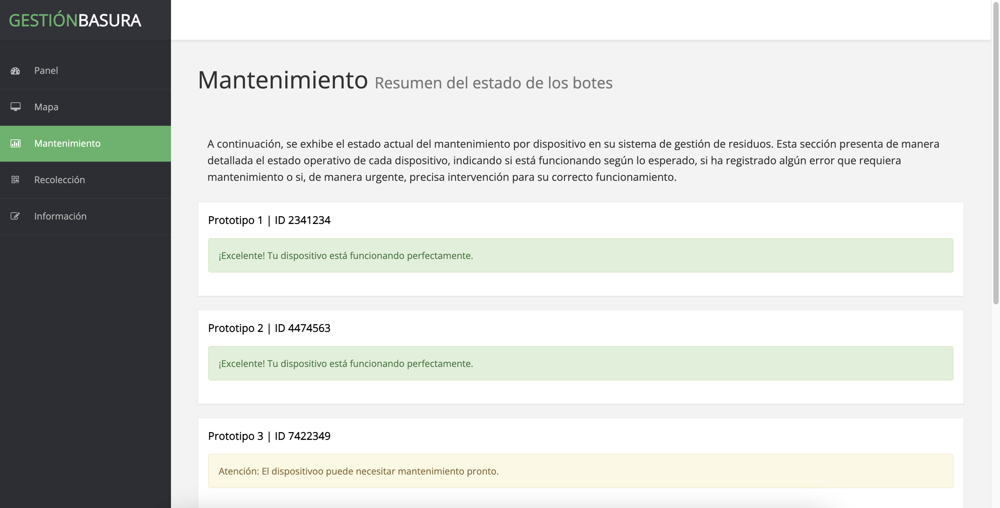
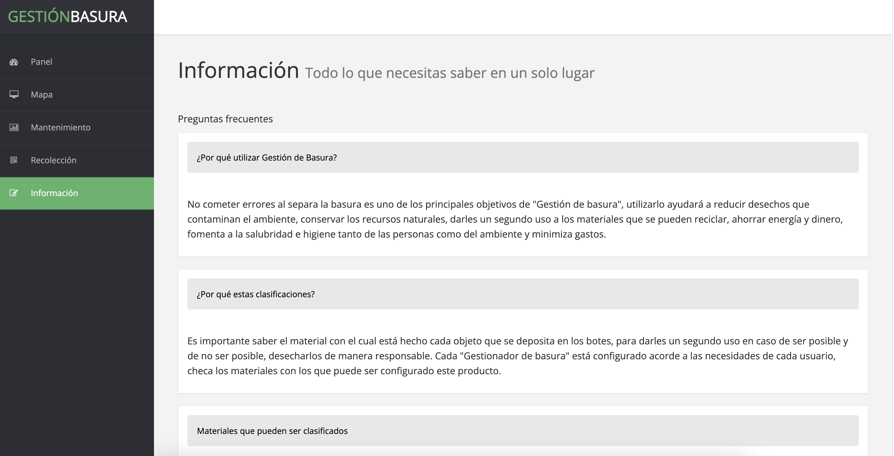

# GestionBasura

GestionBasura es una propuesta para la gestión de residuos mediante la aplicación efectiva de tecnologías IoT, proporcionando una herramienta eficiente y sostenible para mejorar la calidad y eficiencia de la gestión de residuos.

El proyecto consta de un dispositivo de gestión de residuos con capacidad de distinguir entre residuos de plástico y aluminio y un sitio web para controlar la logística de los dispositivos.

### Dispositivo:

- Detección de imagen para clasificar entre residuos de plástico y aluminio.
- Implementación de sensores para detectar la aproximación de personas y la clasificación de residuos.

### Sitio Web:

- Control centralizado a través de un sitio web para gestionar múltiples dispositivos.
- Seguimiento diario de la actividad, recopilando estadísticas sobre el uso diario, la cantidad total de residuos de aluminio y plástico, y la salud general de los dispositivos.
- Funcionalidades de alerta para notificar problemas o mal funcionamiento de los dispositivos.
- Predicción de uso para un mejor manejo de su disposición.

